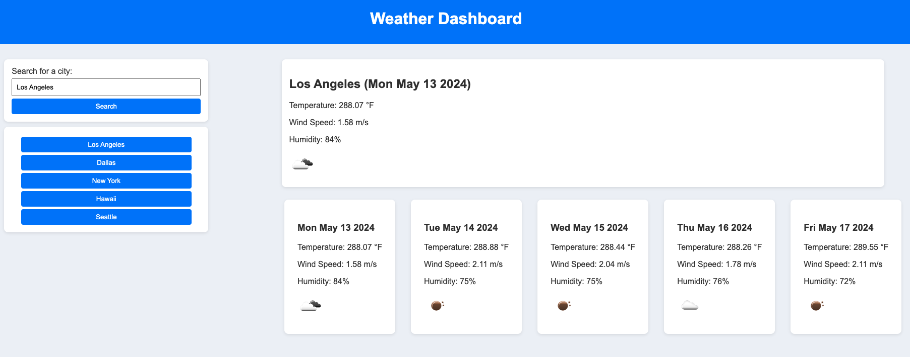

# W6-Challenge: Server-Side APIs Weather Dashboard

## Features

- **City Search**: Users can search for any city to view its current and future weather conditions.
- **Weather Details**: For each searched city, users are presented with the city name, the date, an icon representation of weather conditions, temperature, humidity, and wind speed.
- **Future Forecast**: A 5-day weather forecast is available, showing the date, weather condition icons, temperature, wind speed, and humidity levels.
- **Search History**: Previously searched cities are saved and can be clicked on to revisit the weather conditions for those locations.

## Acceptance Criteria

```
GIVEN a weather dashboard with form inputs

WHEN I search for a city
THEN I am presented with current and future conditions for that city and that city is added to the search history
WHEN I view current weather conditions for that city
THEN I am presented with the city name, the date, an icon representation of weather conditions, the temperature, the humidity, and the wind speed
WHEN I view future weather conditions for that city
THEN I am presented with a 5-day forecast that displays the date, an icon representation of weather conditions, the temperature, the wind speed, and the humidity
WHEN I click on a city in the search history
THEN I am again presented with current and future conditions for that city
```
### Technologies Used

- HTML
- CSS
- JavaScript
- [5 Day Weather Forecast](https://openweathermap.org/forecast5) for weather data


### Setup and Installation

1. Clone the repository to your local machine.
2. Open the index.html file in your web browser to launch the dashboard.
3. Start searching for cities to view their weather conditions.

### Contribution

Contributions to this project are welcome. Please fork the repository and submit a pull request with your proposed changes.

### License

This project is licensed under the [MIT License](https://chatgpt.com/c/LICENSE.md).

## Mock-Up


## Link
https://github.com/yueyue426/W6-Challenge.git